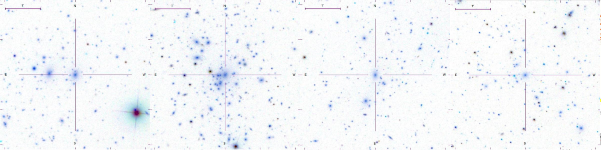
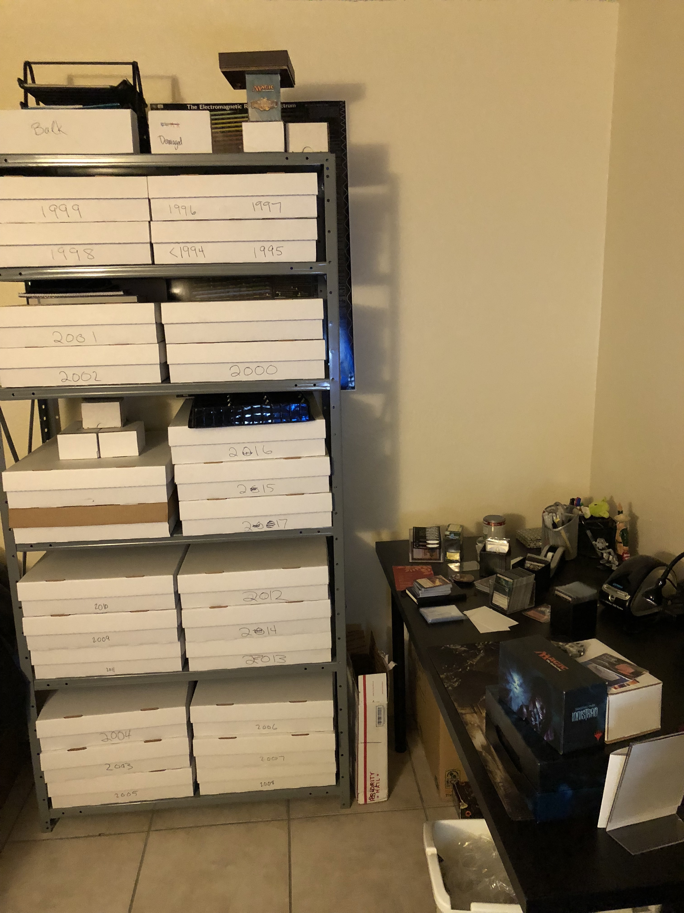

 
I am a PhD student in physics at the University of Arizona working with [Eduardo Rozo](http://w3.physics.arizona.edu/people/eduardo-rozo). My primary research interest is gain a better understanding of dark energy by measuring the abundance of galaxy clusters supplemented with X-ray and/or mm-wave follow-up observation. I am also interested in (but don't get to spend enough time on): galaxy evolution, gravitational lensing (cluster weak lensing, cosmic shear, and strong lensing), photometric redshift estimation, and clever machine learning applications in astronomy.

Currently, I am working with galaxy cluster data from the [Dark Energy Survey](https://www.darkenergysurvey.org/) (DES) and the [South Pole Telescope](https://pole.uchicago.edu/) (SPT). DES is currently the premier photometric survey and has just completed a 6 year run imaging 5,000 square degrees of the southern sky. By looking for overdensities of red galaxies on the sky, DES detected over 7,000 (20,000) galaxy clusters in the first year (first three years) of data alone! SPT is a mm-wave detector that measures minuscule fluctuations in the primordial light from just after the Big Bang - the Cosmic Microwave Background (CMB). As this light  travels through the universe towards us, it scatters off of the hot gas at the center of galaxy clusters. We can then locate galaxy clusters by looking for the resulting "holes" in the CMB.

By comparing the DES and SPT cluster catalogs, I have constructed a complete sample of DES galaxy cluster with SPT measurements. Using this sample, I working towards constraining the scatter in the richness-mass relation to tighten cosmological constraints!

## Professional

I am also a member in the Large Synoptic Survey Telescope (LSST) [Dark Energy Science Collaboration](http://www.lsst-desc.org/) (DESC) where I actively participate in the clusters working group. Within DESC, I am one of the lead developers of CLMM (CLuster Mass Modeling). CLMM is designed to be a software pipeline to measure the bias in cluster lensing experiments. Flexible enough to be run on both real data and simulations, we can directly validate observations. This also enables us to test the sensitivity of the bias measurements to model decisions. 

On the side, I am working with [Dennis Zaritsky](http://djuma.as.arizona.edu/~dennis/) on measuring the dependence of environment on the morphology of galaxies falling into galaxy clusters. Using spectra taken with a low-dispersion prism, we have calculated redshifts with low uncertainties (order of magnitude better than photometric redshifts, order of magnitude worse than spectroscopic redshifts) for about 30,000 galaxies in clusters from the ESO Distance Cluster Survey (EDisCS). Using these redshifts, we can easily identify cluster member galaxies and then explore the features of the local cluster environment.

## Personal
 

In my spare time, I run an online storefront selling Magic: The Gathering trading cards called [Astro TCG](https://shop.tcgplayer.com/sellerfeedback/346ad38b). It has taken over all of the free space in my apartment! 

After purchasing collections of cards, usually thousands at a time, they need to be sorted and graded before I can enter anything into inventory.  

Beyond work and the store, I love both playing and running Dungeons & Dragons games. I run one weekly fifth edition game using an online virtual table top with my friends from college and play in one weekly game with other graduate students in my year.