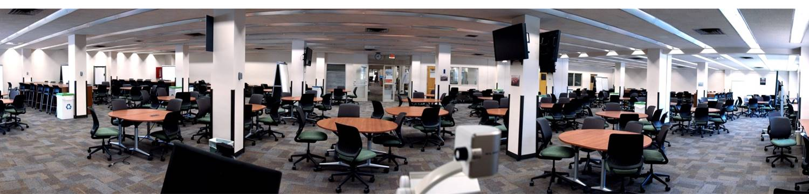

I was the lecturer for one section of about 150 students for physics 102. Physics 102 is the  algebra-based mechanics course for life science majors at the University of Arizona. For this course, a faculty member oversaw the creation of all of the course materials but three graduate students were put in charge of delivering the lectures to the three sections. Out of the three section that semester, my section was chosen to participate in the university's Collaborative Learning Space Pilot Program.

## Collaborative Learning Space Pilot Program

Image Credit: University of Arizona Department of Academic Affairs

During this preceding summer, the university built a prototype room for collaborative learning in the Science and Engineering Library. During the fall semester, many of the large courses were invited to teach their course out of the room. For physics 102, my section was chosen and we used the room for the final $1/3$ of the semester.

The room is designed to facilitate student discussion and interaction between their peers and instructors. Instead of a standard lecture hall, the room consists of many round tables that seat 4-6 people. Each table comes equipped with small whiteboards for personal work and a large, freestanding white board for group work.

In lieu of standard lectures, I delivered material that explicitly highlighted the collaborative nature of the room. The 1 hour sessions were roughly 15-20 minutes of lecture followed by around 30 minutes of group work. During the group work, several undergraduate preceptors and myself would walk around the room and assist struggling groups as well as being available for questions.

After the pilot program, the department of academic affairs put together a report summarizing the results of the experiment as well as comments by the instructors and students working in the room. The report can be found [here](http://academicaffairs.arizona.edu/sites/academicaffairs/files/collaborative-learning-spaces-project-pilot-report-february-2015.pdf).

## Anonymous Student Feedback
The University collects student feedback at the end of each semester for each course.
My feedback for the course is below.
